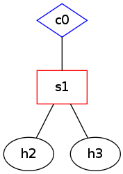

## 创建网络

Mininet 的操作十分简单，启动一个小型测试网络只需要下面几个步骤。
登录到虚拟机命令行界面，打开 wireshark，使其后台运行, 命令为 `sudo wireshark &`。

启动 Mininet，命令为`sudo mn`，则默认创建如下图所示的网络拓扑。

经过短暂的等待即可进入以 `mininet>` 引导的命令行界面。
好了，从现在开始，我们就拥有了一个 1 台控制节点(controller)、一台交换(switch)、两台主机(host)的网络，并且用 wireshark 进行观测。
