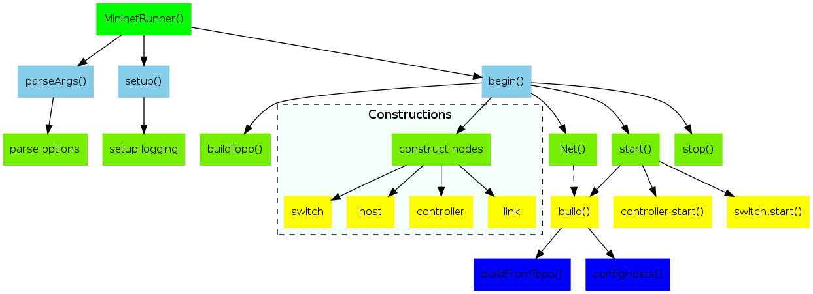

## mn
该脚本定义了一个 MininetRunner 类，用来表示模拟网络的主程序。

主要过程是创建一个 MininetRunner() 实例，依次解析传入参数，进行初始化后开启网络。

整体过程如下图所示。



其中 Mininet 类的 start() 方法是核心的启动过程，主要包括调用 build 方法来根据拓扑创建网络、控制器、交换机、主机和连接等。之后依次启动控制器和交换机进程。
在执行完 start() 之后，通过 test 参数来判断 mininet 运行的模式。
```
if test == 'none':
            pass
        elif test == 'all':
            mn.start()
            mn.ping()
            mn.iperf()
        elif test == 'cli':
            CLI( mn )
        elif test != 'build':
            getattr( mn, test )()
```
默认情况下，参数为 cli，即进入到控制台模式，允许用户自己输入对 Mininet 的操作命令。
最终执行 mininet.stop() 进行删除资源的工作。
